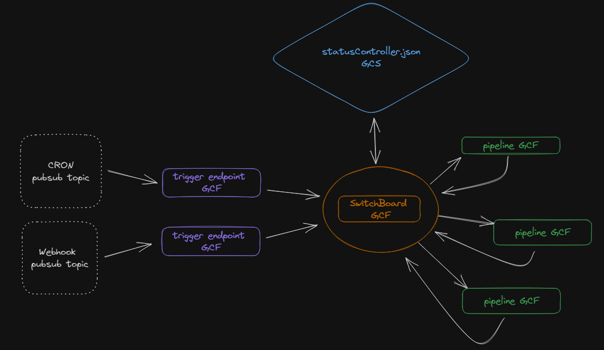

# SwitchBoard

SwitchBoard is a library designed to be used with severless functions for creating data pipelines and applying orchestration logic.

## What problem does SwitchBoard solve?

There are many tools for orchestration out there already like Airflow, Luigi, Google Workflows, etc. However, for simpler and lower volume use cases, there are a few problems with using previously existing tools.
* Most orchestration tools need a dedicated instance to run. This is typically an additional cost that can seem unreasonable given less complex use cases that still have an orchestration need.
* In the case of something like Workflows, a Workflow has to be defined and event_arc triggers set up to manage orchestration. Additional tools means additional technologies to manage. This adds seemingly unnecessary complexity to low complexity projects.
* Managing tools designed with complex data flows in mind for simple projects can feel a bit over engineered. Sort of like taking a helicopter to the grocery store.  

SwitchBoard attempts to provide a simplistic option by enabling a development environment without having to align between multiple tools.  
Multiple data pipelines can be built and orchestration managed using the SwitchBoard library all within a monorepo, or multiple if desired.  
  
Currently, only Python and Google Cloud are supported. There are plans to support other languages and cloud providers in the future.  
## How does it work?

SwitchBoard is comprised of four main components: **Callers**, **DataSources**, **Pipelines**, **StatusControllers**, and **a SwitchBoard**.  
  
* A **Caller** is created and passes caller information to the **SwitchBoard**.  
* The **SwitchBoard** will determine the appropriate **Pipeline** to execute and reference the **StatusController** to verify the dependency requirements, if any, have been met.  
* The **Pipeline** will use a specific **DataSource** to perform the specified task.  
* On completion, the **Pipeline** will send confirmation to the **SwitchBoard** that it was executed successfully.  
* The **SwitchBoard** then updates the **StatusController** and identifies any downstream **Pipeline** to execute.  
  

